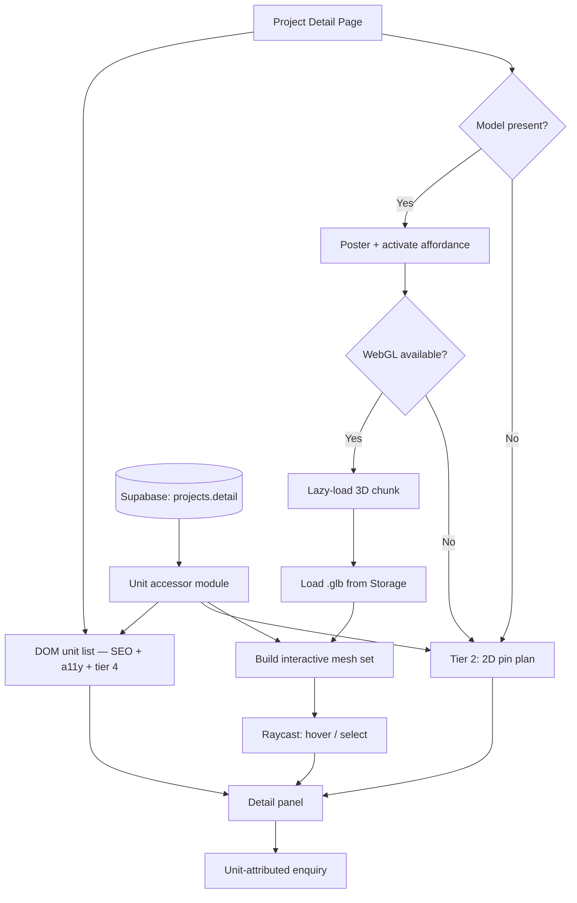

# Interactive 3D Floor Plan — Product Requirements Document

**Asan Innovators** | Prepared by: Kalyan Kumar Bedugam (AK)
**Client:** Prime Developers | **Version:** 1.1

---

## 0. Decisions Taken During Build

Recorded here rather than edited invisibly into the sections below, so the
reasoning stays auditable.

| # | Decision | Effect |
|---|---|---|
| D1 | **The 3D model is the sole geometry source.** The plan view visitors see is the top-down orthographic projection of the same `.glb`, not a separate drawing. | The uploaded plan image is demoted to a fallback for buildings with no model. There is no longer a second placement to maintain, so 2D and 3D cannot disagree. |
| D2 | **Manual pin placement is hidden when a model exists.** | Each unit shows one placement indicator — *Linked to 3D model* / *No shape in model* — instead of a pin control that would create a second source of truth. |
| D3 | **The poster is captured from the live view.** | One asset per building: the `.glb`. No separate preview image to source or keep current. |
| D4 | **Renaming a unit promotes its name match to an explicit binding.** | Closes the highest-frequency silent failure: renaming `301` to `301A` used to sever the unit from its shape with no warning. |
| D5 | **Duplicate unit labels are surfaced as an admin error.** | Previously the second unit silently became unmodelled, since only the first can bind. |
| D6 | **All buildings are single storey** (client-confirmed). | Floor isolation (US-17) is not required. Stacked-floor raycasting and hidden interior suites — the two hardest geometry problems in §Edge Cases — do not apply. |
| D7 | **Non-unit geometry is merged into one mesh at load.** | Scenery collapses to a single draw call. Meshes named `unit-*` stay individually addressable, so unmatched ones remain bindable. |
| D8 | **The Site Plan page section was removed**, along with its editor. | Superseded by D1. Existing `detail.sitePlan` data is left in the database untouched. |
| D9 | **Additional per-unit fields**: floor, lease rate, frontage, description. | All optional; blank fields are omitted from the detail card rather than rendered empty. |

---

## 1. Overview

### 1.1 Problem

Prime Developers markets commercial buildings with leasable and saleable units. The current site presents each building as a flat floor plan image with circular pins dropped on it (`src/components/FloorPlanInteractive.jsx`). A prospect sees a diagram, not a place. Three specific failures follow from that:

1. **No spatial comprehension.** A 2D plan does not communicate building height, unit adjacency across floors, parking proximity, or how a suite sits relative to the road. These are the questions a commercial tenant actually asks.
2. **Pins are not the unit.** A pin says "something is here." It does not show the shape, the footprint, or the boundary of what is being leased. Prospects cannot tell how big Unit 405 is relative to Unit 406 without reading numbers.
3. **Availability is invisible at a glance.** Today a prospect must click each pin in turn to learn its status. There is no way to see "show me everything available" as a single visual answer.

The commercial consequence: enquiries arrive under-qualified, and the sales team spends first-call time explaining geometry instead of negotiating terms.

### 1.2 Solution

An interactive 3D model of each building and its site, rendered in the browser, where **every leasable unit is a hoverable, clickable object**. Hovering a unit highlights it and surfaces a label. Clicking it opens the unit's full detail. Units are coloured by live availability status pulled from the CMS, so a prospect sees at a glance what is available, leased, coming soon, or sold.

The 3D asset itself is a `.glb` file uploaded by an administrator through the existing admin portal. **The model carries no data.** It carries geometry and mesh names. All unit information — label, status, area, tenant — continues to live in Supabase and continues to be edited exactly where it is edited today. The binding between the two is a naming convention resolved at runtime.

This is the load-bearing design decision of the entire feature, and everything else follows from it: **the model is a dumb asset, the database is the source of truth.** A status change in the CMS is reflected in the 3D view on next load, with no re-modelling, no re-upload, and no developer involvement.

### 1.3 Target Users

| User | Context | What they need from this |
|---|---|---|
| **Prospective tenant / buyer** | Evaluating commercial space, often comparing 3–5 properties | Fast spatial understanding; which units are free; how big; where |
| **Broker / agent** | Screening on behalf of a client, often on mobile between site visits | Shareable deep link to one specific unit; accurate availability |
| **Prime Developers admin** | Non-technical; updates listings as deals close | Change a unit's status in seconds without touching the model |
| **Prime Developers sales** | Fielding enquiries | Enquiries that arrive attached to a specific unit, not a generic form |

### 1.4 Reference

The visual and interaction benchmark is the Smplrspace-powered site plan used by BluePixel (bluepxl.com) — a white massing model of a business park viewed at an isometric angle, with unit numbers, parking markers, and site features labelled in place. Notably the reference is **not photorealistic**: it is flat-shaded extruded massing. This materially reduces modelling cost and is adopted deliberately, not as a compromise.

---

## 2. Goals and Success Metrics

### 2.1 Goals

- **G1.** A prospect can identify every available unit in a building within five seconds of the viewer loading, without clicking anything.
- **G2.** An administrator can publish a new building's 3D view end-to-end without engineering support, given a correctly prepared `.glb`.
- **G3.** Availability shown in 3D is never stale relative to the CMS.
- **G4.** The feature degrades gracefully to a fully usable experience on any device or crawler that cannot run WebGL.

### 2.2 Success Metrics

| Metric | Definition | Target |
|---|---|---|
| 3D engagement rate | Sessions on a project detail page that activate the 3D viewer | > 40% |
| Unit interactions per session | Distinct units hovered or clicked per engaged session | > 4 |
| Unit-attributed enquiries | Leads carrying a `unit` reference vs. generic enquiries | > 50% of leads |
| Time to first meaningful frame | Poster visible → model interactive, median, on 4G | < 3.5s |
| Admin self-service rate | Building 3D views published without a developer touching code | 100% |
| Fallback correctness | Sessions rendering the 2D fallback that still reach a unit detail | 100% |

### 2.3 Non-Goals

Photorealism, interior walkthroughs, virtual staging, and furniture placement are explicitly not goals. The model exists to answer *where and how big*, not *how does it feel inside*.

---

## 3. User Personas

**Ravi — Operations Head, mid-size logistics firm.** Needs 4,000–6,000 sq ft with dock access. Evaluates on a laptop, shortlists three properties, forwards links to his MD. Cares about: which units are free, contiguous area, truck access, parking count. Will not read a PDF brochure. **Success looks like:** he sends his MD a link that opens directly on Unit 405, already highlighted.

**Priya — Commercial broker.** Runs 8–10 active enquiries. Lives on her phone between site visits. Needs accurate, current availability more than anything else — showing a client a unit that was leased last week costs her credibility. **Success looks like:** the mobile experience loads fast, availability is correct, and she can filter to "available only" in one tap.

**Suresh — Prime Developers admin.** Not technical. Updates the site when a deal closes, usually under time pressure. Has never opened a 3D tool. **Success looks like:** he changes a dropdown from Available to Leased, saves, and the building's 3D view reflects it — he never learns what a mesh is.

---

## 4. User Stories

### P0 — Required for launch

- **US-01.** As a prospect, I can view a 3D model of the building and orbit it, so I understand its form and site context.
- **US-02.** As a prospect, I can hover any unit and immediately see its label, status, and area without clicking.
- **US-03.** As a prospect, I can click a unit to open its full details, and the camera frames that unit.
- **US-04.** As a prospect, I can see unit availability encoded as colour, so I can read the whole building at a glance.
- **US-05.** As a prospect on a device that cannot run 3D, I get a fully functional 2D experience with the same information.
- **US-06.** As an admin, I can upload a `.glb` for a building through the admin portal.
- **US-07.** As an admin, I can see which meshes in my uploaded model matched which units, and fix any that did not match.
- **US-08.** As an admin, when I change a unit's status, the 3D view reflects it without any further action from me.
- **US-09.** As a broker, I can share a URL that opens the viewer with one specific unit pre-selected.

### P1 — Strongly desired

- **US-10.** As a prospect, I can filter the view by status so non-matching units visually recede.
- **US-11.** As a prospect, I can toggle between the 3D view and a top-down 2D view of the same model.
- **US-12.** As a prospect, I can enquire about a specific unit directly from its detail panel, and the enquiry carries the unit reference.
- **US-13.** As a keyboard or screen-reader user, I can reach and select every unit without using a pointer.
- **US-14.** As an admin, I am warned before uploading a model that exceeds the performance budget.

### P2 — Post-MVP

- **US-15.** As a prospect, I can select two or more adjacent available units and see their combined area.
- **US-16.** As a prospect, I can compare shortlisted units side by side.
- **US-17.** As a prospect, I can see per-floor breakdowns for multi-storey buildings by isolating a floor.
- **US-18.** As an admin, I can reposition or re-orient the default camera framing per building.

---

## 5. Feature Specification

### 5.1 The Model Asset Contract

This section defines the only interface between the 3D asset and the application. It is a contract, and it is deliberately narrow.

**Naming.** Every mesh representing a leasable unit is named `unit-<label>`, where `<label>` exactly matches the `label` field of a unit in the CMS.

```
unit-301    →  binds to unitList entry with label "301"
unit-405    →  binds to unitList entry with label "405"
unit-A2     →  binds to unitList entry with label "A2"
```

**Matching rules.**
- Prefix `unit-` is stripped; the remainder is compared to `label`.
- Comparison is case-insensitive and whitespace-trimmed.
- Any mesh whose name does not begin with `unit-` is **inert scenery** — roads, kerbs, parking bays, landscaping, the detention pond, neighbouring massing. It renders, it is never interactive, and it is never highlighted.
- Any mesh that begins with `unit-` but matches no unit is flagged in the admin reconciliation screen as **unmatched**. It renders as scenery until an admin binds it.
- Any unit in the CMS with no corresponding mesh is flagged as **unmodelled**. It remains fully functional in the 2D fallback and in the unit list; it simply cannot be clicked in 3D.

**Manual binding override.** Where a mesh name cannot be corrected in the source model, an admin may bind it explicitly. Overrides are persisted per building and take precedence over name matching.

**Asset requirements.**

| Property | Requirement | Rationale |
|---|---|---|
| Format | `.glb` (binary glTF 2.0) | Single file, no external references |
| Compression | Draco or Meshopt, mandatory | Uncompressed models routinely exceed 40 MB |
| File size | **≤ 8 MB** — hard limit, enforced at upload | Mobile data and memory ceiling |
| Triangles | ≤ 150,000 | Mid-range Android GPU budget |
| Up axis | Y-up | glTF convention; avoids per-model correction |
| Units | Metres | Consistent camera framing across buildings |
| Origin | Site centre, ground at Y = 0 | Predictable default camera and orbit target |
| Materials | One material per mesh; no PBR texture sets required | Massing aesthetic; keeps draw calls and file size low |
| Lighting | Baked ambient occlusion only; no lights, no cameras exported | Runtime lighting is controlled by the application |
| Textures | Avoided. Labels are rendered by the application, not baked | Labels must reflect live CMS data |

Rejecting an over-budget model at upload with a clear, human-readable message is a P0 requirement, not a nicety. It is the only reliable defence against a well-meaning admin publishing a model that crashes phones.

### 5.2 Public Viewer

**Loading behaviour.** The viewer does not initialise WebGL on page load. It renders a poster image with a play affordance. WebGL initialises only on explicit user intent — a click or tap. This protects page-load performance, battery, and low-memory devices, and means a user who never engages the 3D pays nothing for it.

**Rendering.** Render-on-demand, not a continuous animation loop. Frames are drawn on interaction, on camera settle, and on data change. A static scene consumes no GPU time. The render loop also suspends when the canvas leaves the viewport.

**Camera.** Default framing is an isometric-leaning three-quarter view matching the reference aesthetic, computed to fit the model's bounding box. Orbit is damped. Polar angle is clamped so the camera cannot pass below the ground plane or directly overhead. Zoom is clamped to a sensible range around the bounding box.

**Control cluster.** Adopted from the reference implementation, which has already validated this set:

| Control | Behaviour |
|---|---|
| Fullscreen | Expands the viewer to the full viewport |
| Recenter | Eases the camera back to default framing |
| Labels toggle | Shows or hides persistent unit labels |
| Zoom + / − | Discrete zoom steps, for users who cannot pinch or scroll |
| 2D toggle | Switches to a top-down orthographic projection of the same model |

The 2D toggle is worth calling out: it is the same scene, same meshes, same interactions, viewed through an orthographic camera from above. It gives users who find orbiting disorienting a familiar plan view without a second implementation.

**Lighting.** A hemisphere light plus a single soft directional light. No real-time shadows — shadow maps are the single most expensive thing available and contribute nothing to a flat massing aesthetic. Depth reads from baked AO and edge treatment.

### 5.3 Interaction

**Hover (pointer devices).**
- Raycast against the interactive mesh set only. Scenery is excluded from raycasting entirely, which keeps the cast cheap.
- The hovered mesh receives an emissive lift in its status colour.
- Cursor changes to a pointer.
- A floating chip follows the cursor showing: unit label, status pill, and area.
- Raycasting is throttled to animation frames and skipped entirely while the camera is moving.

**Click / tap (select).**
- Selection is exclusive — one unit at a time in MVP.
- The selected mesh receives a persistent outline treatment, distinct from hover.
- The camera eases to frame the selected unit, preserving the current orbit angle rather than snapping to a fixed view. Preserving angle matters: snapping disorients users who have deliberately rotated to see something.
- The detail panel populates. This reuses the existing card markup so 2D and 3D presentations cannot drift apart.
- The URL updates to include the unit reference, without a navigation.

**Touch devices.** There is no hover. Tap selects directly and shows the detail panel. One-finger drag orbits, two-finger pinch zooms, two-finger drag pans. The floating hover chip is suppressed; its content is folded into the detail panel, which on mobile presents as a bottom sheet.

**Status colour.** Colours derive from the existing four statuses. `src/lib/unitStatus.js` is currently the declared single source of truth for status presentation but exposes only Tailwind class strings, which a WebGL material cannot consume. It must be extended with an explicit colour value per status so the legend, the 2D pins, and the 3D materials all read from one place.

| Status | Behaviour in 3D |
|---|---|
| `available` | Full-saturation status colour; the visual focus of the scene |
| `leased` | Muted, lower saturation |
| `coming-soon` | Full-saturation accent colour |
| `sold` | Muted |
| unmodelled / unmatched | Renders as neutral scenery, non-interactive |

The status list is data-driven throughout. Adding statuses later — `reserved`, `under-contract`, `model` — requires only an entry in the status module and no change to the viewer.

**Legend and filtering (P1).** The legend doubles as a filter. Selecting "Available" desaturates every non-available unit to neutral grey, leaving available units in full colour. This is the highest-value interaction in the entire feature for a leasing audience, and it is nearly free once per-mesh material control exists.

**Deep linking.** `?unit=301` on a project detail page selects that unit, frames the camera on it, and opens its detail panel. If the referenced unit does not exist, the viewer loads in its default state and no error is surfaced to the user. Deep links must work in the 2D fallback as well — same parameter, same resulting selection.

### 5.4 Admin: Upload and Reconciliation

Upload alone does not make this feature self-service. Reconciliation does. This screen is the difference between an admin publishing a building unaided and filing a ticket.

**Upload.** A model uploader sits inside the existing building editor (`src/admin/components/BuildingBlock.jsx`), directly beneath the current floor plan image uploader, since the two are alternative presentations of the same building.

On file selection, before the upload commits:
1. Validate extension and MIME type.
2. Validate file size against the 8 MB budget. Over budget is rejected with a specific message naming the actual size and the limit, and pointing at Draco compression.
3. Parse the model client-side and extract mesh names and triangle count.
4. Validate triangle count against budget; warn but do not block.
5. Present the reconciliation report.

**Reconciliation report.** Plain language, no 3D vocabulary:

> **14 units found in the model. 12 matched.**
> ⚠️ 2 shapes in the model do not match any unit: `unit-311`, `unit-312`
> ⚠️ 1 unit has no shape in the model: `409`

Each unmatched mesh offers a dropdown of unbound units. Selecting one creates a persisted manual binding. Each unmodelled unit is listed so the admin knows it will be absent from 3D — with the explicit reassurance that it still appears in the 2D plan and unit list.

**Admin preview.** The same viewer component used publicly, embedded in the editor, so the admin sees precisely what a visitor will see. Clicking a mesh in the preview while an unmatched entry is armed binds it — mirroring the arm-then-click pattern already established by `FloorPlanPositionPicker.jsx` for 2D pin placement. Interaction consistency across the admin is worth more than novelty here.

**Re-upload.** Re-uploading a model for a building that already has one must never silently break existing bindings. The system re-runs reconciliation and presents a diff:

> Compared to your previous model: 12 units still match. `unit-405` is no longer present. 1 new shape found: `unit-410`.

Existing bindings that still resolve are preserved. Bindings whose mesh disappeared are surfaced for re-binding, not deleted.

**Poster image.** Auto-generated by capturing the default camera framing on first successful load, so admins get a correct poster with no extra step. Overridable with a manual upload.

**Removal.** Deleting a model reverts the building cleanly to its 2D floor plan image. No orphaned state, no broken viewer.

### 5.5 Fallback Tiers

Four tiers, evaluated in order. Every tier reaches full unit information — the fallbacks are presentational, never informational.

| Tier | Condition | Presentation |
|---|---|---|
| 1 | WebGL available, model present, user activates | 3D interactive viewer |
| 2 | WebGL unavailable, or model absent | Existing 2D floor plan image with positioned pins |
| 3 | No floor plan image | Unit list with full details per unit |
| 4 | No JavaScript, or a crawler | Server-rendered unit list — always present in the DOM |

**Tier 4 is a hard requirement and must be understood clearly: a WebGL canvas is invisible to search engines and to screen readers.** Nothing inside it is indexable or announceable. Unit availability is exactly the content most worth indexing on this site.

The resolution is a single design decision that satisfies three separate requirements at once: **render a unit list in the DOM alongside the 3D viewer, synchronised with selection.** That list is simultaneously the SEO surface, the keyboard and screen-reader navigation path, and the no-WebGL fallback. It is not a hidden accessibility shim — it is a visible, useful part of the interface that happens to also be machine-readable.

`FloorPlanInteractive.jsx` is retained, not replaced. It becomes tier 2.

---

## 6. Technical Constraints

**Current stack.** React 19, Vite 8, React Router 7, Tailwind 4, Supabase JS, GSAP / Motion / Lenis, deployed to Firebase Hosting. Unit data is stored as JSONB on `projects.detail`, not in relational tables.

**Planned migration.** A migration to Next.js is planned in order to satisfy the server-rendering and SEO requirement. This feature must be built so the migration is not disruptive:
- The viewer is a client-only component. Under Next.js it is imported dynamically with SSR disabled.
- All data access goes through a single accessor module rather than inline queries, so the fetch layer changes in one place.
- The DOM unit list is written as presentational markup with no browser-only dependencies, so it server-renders unchanged.

**Bundle.** `three` plus `@react-three/fiber` plus `@react-three/drei` is roughly 600 KB gzipped. It must be code-split into its own chunk, loaded only when a user activates the viewer, and must never enter the main bundle. This is verified by inspecting the build output, not assumed.

**Storage.** A dedicated `models` bucket in Supabase Storage, separate from the existing `images` bucket — different size limits and MIME allowances. RLS mirrors the images bucket policies already defined in `supabase/migrations/00000000000001_schema.sql`: public read, authenticated write, update, and delete. Filenames are content-hashed with a long `Cache-Control` max-age, since a given model is immutable.

**Browser support.** WebGL 2 where available, WebGL 1 fallback. Feature detection at activation, not at page load. Any failure — no WebGL, context creation failure, context loss — falls through to tier 2 silently, without an error message to the user.

**Performance budget.** Non-negotiable, enforced in review:

| Budget | Limit |
|---|---|
| Model file size | 8 MB |
| Triangles | 150,000 |
| Draw calls | < 60 |
| Time to interactive after activation, 4G | < 3.5s |
| Sustained frame rate while orbiting, mid-range mobile | ≥ 30 fps |
| GPU time while idle | Zero — render on demand only |
| Main-bundle impact | Zero bytes |

---

## 7. Data Model

### 7.1 Current Shape

Unit data lives at `projects.detail.floorPlans.buildings[i]`:

```jsonc
{
  "building":  "Building 07",
  "area":      "48000",
  "number":    "07",
  "units":     "12",
  "available": "4",
  "parking":   "60",
  "planImage": "https://…/floor-plan/plan-07.jpg",
  "unitList": [
    { "label": "301", "status": "available", "size": "4200", "tenant": "", "x": 42.1, "y": 31.8 }
  ]
}
```

### 7.2 Addition

One new object per building. No migration is required — the existing JSONB column absorbs it.

```jsonc
{
  "model": {
    "url":        "https://…/models/bldg-07-a3f9c2.glb",
    "poster":     "https://…/models/bldg-07-poster.jpg",
    "uploadedAt": "…",
    "fileSize":   6291456,
    "triangles":  118400,
    "meshNames":  ["site-ground", "unit-301", "unit-302"],
    "bindings":   { "unit-311": "301", "unit-312": "302" },
    "camera":     { "azimuth": 45, "polar": 55, "distance": 1.0 }
  }
}
```

- `meshNames` is captured at upload so the admin reconciliation report and the
  re-upload diff can run without downloading and re-parsing the model on every
  visit to the editor.

- `bindings` holds **manual overrides only**. Meshes that match by name are not stored — storing them would create a second source of truth that drifts.
- `camera` is optional per-building framing (P2, US-18). Absent means auto-fit.
- `x` / `y` on units are retained and unchanged. They drive the 2D fallback, which remains live.

### 7.3 Lead Attribution

`public.leads` gains four nullable columns so an enquiry carries the unit it
came from: `unit_label`, `unit_status`, `building`, `source_url`.

`unit_status` records availability **at the time of enquiry**. When a prospect
asks about a unit that is leased three days later, sales needs to know it was
genuinely available when they asked — otherwise a legitimate enquiry looks like
the site served stale data.

### 7.4 Under Relational Migration

Should the planned migration to relational `buildings` / `units` tables proceed, this maps directly with no loss:

| JSONB path | Relational equivalent |
|---|---|
| `buildings[i].model.url` | `buildings.model_url` |
| `buildings[i].model.poster` | `buildings.model_poster_url` |
| `buildings[i].model.camera` | `buildings.model_camera` (jsonb) |
| `bindings["unit-311"] = "301"` | `units.mesh_name = 'unit-311'` |

The binding map becoming a column on the unit is strictly better — it makes the relationship a first-class property of the unit rather than a lookup table. Design the accessor module now so this substitution is invisible to the viewer.

---

## 8. Architecture



Two properties of this shape matter:

**The accessor module is the single fan-out point.** Every presentation tier — 3D, 2D, DOM list — reads unit data from one place. They cannot disagree about availability, and the fetch layer can be swapped wholesale during the Next.js migration by editing one module.

**The detail panel is shared.** All three tiers converge on the same component. A copy change or a new field appears everywhere at once.

---

## 9. Non-Functional Requirements

**Reliability.** Model load failure, WebGL context loss, and malformed glTF each fall through to tier 2 without user-visible error. Context loss specifically must be handled — mobile browsers reclaim WebGL contexts under memory pressure, and an unhandled loss leaves a blank canvas where content should be.

**Security.** Model uploads are authenticated-only, matching existing storage policy. Server-side MIME and size validation, because client-side validation is a UX affordance and not a control. Models are public-read by design — they are marketing assets.

**Maintainability.** Status definitions, colours, and labels live in one module. Adding a status touches one file. The viewer contains no hardcoded unit labels, building names, or colours.

**Privacy.** The feature collects no personal data. Analytics events are anonymous interaction events. Tenant names shown on leased units are commercial information the client already publishes.

---

## 10. Competitive Analysis

| Capability | BluePixel (Smplrspace) | Typical CRE listing site | Static PDF brochure | **This feature** |
|---|---|---|---|---|
| 3D site model | Yes, vendor-modelled | No | No | Yes, self-hosted |
| Hover unit details | Yes | No | No | Yes |
| Live availability | Yes, via SDK | Partial, manual | No | Yes, from CMS |
| Admin self-service | Data only — geometry is a vendor service | N/A | N/A | **Data and geometry** |
| Recurring cost | Per-space subscription | Listing fees | None | **None** |
| Vendor watermark | Yes | N/A | No | **No** |
| Geometry ownership | Vendor account | N/A | Client | **Client** |
| Financial calculators | Extensive | Limited | No | Not in scope |
| Demographics / traffic data | Yes, paid feeds | Some | No | Not in scope |
| SEO-indexable unit data | No — canvas only | Yes | No | **Yes, DOM list** |

**Differentiation.** Against the reference implementation, this feature wins on ownership, cost structure, and indexability, and concedes on breadth of analytics. That concession is correct: Prime Developers is a developer marketing its own portfolio, not a listings platform selling market intelligence to brokers. Building demographic and comparables tooling would mean licensing paid data feeds to serve a need Prime Developers does not have.

The one genuine gap worth noting for future consideration is **catchment data** — traffic counts and area demographics materially influence a commercial tenant's decision and are available from public sources at low cost. That is a separate feature, not a dependency of this one.

---

## 11. User Journey Map

**Primary persona: Ravi, Operations Head, seeking 4,000–6,000 sq ft.**

| Stage | What he does | What he feels | What the feature must do |
|---|---|---|---|
| **Discovery** | Arrives from search or a broker's link on the project page | Skeptical — has seen four sites today | Poster frame must read instantly as *a real place*, not a diagram |
| **Activation** | Taps the 3D view | Mild impatience | Load under 3.5s or he scrolls past |
| **Orientation** | Orbits once, gets his bearings | Interest — this is more than a PDF | Damped, forgiving controls; clamped so he cannot get lost under the ground |
| **Scanning** | Reads colour, looks for available units | Focused | Availability legible at a glance without a single click |
| **Filtering** | Filters to available only | Relief — noise gone | Non-matching units recede, do not vanish; context is preserved |
| **Evaluation** | Hovers three candidates, compares areas | Deliberating | Hover chip must show area immediately; no click required to compare |
| **Selection** | Clicks Unit 405; camera frames it | Committed to a candidate | Camera preserves his chosen angle; detail panel is complete |
| **Sharing** | Copies the URL, sends to his MD | Slight risk — is he wasting the MD's time | Link must open on Unit 405, already selected, on any device |
| **Enquiry** | Submits the form from the unit panel | Ready | Enquiry carries the unit reference; no re-entry of what he is asking about |
| **Follow-up** | Sales calls | Expects them to know | Lead record identifies Unit 405 |

**The two failure points to design against** are activation, where a slow load loses him before the feature has shown any value, and sharing, where a link that opens on the default view instead of Unit 405 makes him look careless to his MD and makes Prime Developers look unpolished.

---

## 12. Notification and Communication Strategy

The feature itself sends no notifications. It is the origin of one communication flow — the unit-attributed enquiry.

| Trigger | Channel | Recipient | Content |
|---|---|---|---|
| Enquiry submitted from a unit panel | Email | Prime Developers sales | Unit label, building, status at time of enquiry, area, enquirer details, source URL |
| Enquiry submitted | On-screen confirmation | Enquirer | Acknowledgement naming the specific unit, so it is clear the enquiry was attributed |
| Model upload rejected | Inline admin message | Admin | Actual file size, the limit, and the specific remedy — compress with Draco |
| Reconciliation warnings | Inline admin panel | Admin | Unmatched meshes and unmodelled units, with the binding control adjacent |
| Re-upload diff | Inline admin panel | Admin | What changed relative to the previous model, before commit |

**Recording status at time of enquiry** is worth the extra field. When a prospect enquires about a unit that is leased three days later, sales needs to know the unit was genuinely available when the enquiry was made rather than assuming a stale-data complaint.

No transactional email provider is currently wired into the project. Delivery of the enquiry email depends on that being provisioned; the enquiry record itself is written to the database regardless, so no lead is lost while that dependency is outstanding.

---

## 13. Analytics and Tracking Plan

Instrumented from the first commit, not retrofitted. Every event carries `project_id`, `building`, and where applicable `unit_label` and `unit_status`.

| Event | When | Key properties |
|---|---|---|
| `floorplan_viewed` | Project detail page renders a floor plan section | `tier` (3d / 2d / list) |
| `model_activated` | User activates the 3D viewer | `device_type` |
| `model_load_succeeded` | Model interactive | `duration_ms`, `file_size`, `triangles` |
| `model_load_failed` | Load or context failure | `reason`, `fallback_tier` |
| `unit_hovered` | Hover settles ≥ 300ms | `unit_label`, `unit_status` |
| `unit_selected` | Unit clicked or tapped | `unit_label`, `unit_status`, `source` (3d / 2d / list / deeplink) |
| `status_filter_applied` | Legend filter toggled | `status` |
| `view_mode_toggled` | 3D ↔ 2D orthographic | `to_mode` |
| `unit_deeplink_opened` | Page loaded with a unit parameter | `unit_label`, `resolved` (bool) |
| `unit_enquiry_submitted` | Enquiry sent from a unit panel | `unit_label`, `unit_status` |
| `model_uploaded` | Admin upload succeeds | `file_size`, `triangles`, `matched`, `unmatched`, `unmodelled` |
| `model_upload_rejected` | Validation fails | `reason`, `file_size` |
| `mesh_bound_manually` | Admin creates a binding | `mesh_name`, `unit_label` |

**The three that matter most:** `model_load_failed` with its `reason` and `fallback_tier` tells you whether the fallback strategy is actually working in the field rather than only in testing. `unit_selected` with `source` reveals whether 3D genuinely drives engagement or whether users find units through the list anyway — which would be a strong signal to stop investing here. `mesh_bound_manually` firing frequently means the modelling brief is not being followed and the fix belongs upstream with the modeller, not in the interface.

Hovers are debounced at 300ms so that sweeping the cursor across a building does not generate a dozen meaningless events.

---

## 14. Error and Empty States

| State | Condition | Presentation |
|---|---|---|
| No model, no plan image | Building has neither asset | Unit list only. No empty 3D frame, no placeholder graphic |
| No model, plan image present | Model not yet uploaded | Existing 2D pin plan. No mention of 3D — its absence is not an error |
| Model loading | Between activation and interactive | Poster remains visible with a determinate progress indicator. Never a blank canvas |
| Model load failed | Network or parse failure | Silent fall-through to 2D. No user-facing error. Logged as an analytics event |
| WebGL unavailable | Detection fails at activation | Fall-through to 2D. Optional, understated note that 3D is unsupported on this device |
| Context lost | Browser reclaims the GPU context | One automatic restore attempt; on failure, fall through to 2D preserving current selection |
| Model has zero interactive meshes | Uploaded but nothing matched | **Public:** treated as no model, falls to 2D. **Admin:** prominent warning explaining that no shape matched any unit, with the naming convention shown |
| Unit has no mesh | Unmodelled unit | Present and fully functional in the list and 2D plan. Not referenced in the 3D view |
| Deep link to unknown unit | `?unit=999` with no match | Default view, no error. Analytics records `resolved: false` |
| Empty unit list | Building has no units | Section is not rendered at all |
| Admin: file over budget | > 8 MB | Rejected before upload, naming actual size, the limit, and the Draco remedy |
| Admin: wrong file type | Not `.glb` | Rejected on selection with the accepted format stated |
| Admin: upload interrupted | Network failure mid-upload | Previous model and bindings untouched. Retry offered |
| Slow connection | Load exceeds 10s | Progress persists with an option to continue in 2D instead |

**The governing principle:** a visitor should never be told that something failed. Every failure path has a working destination, and the visitor arrives there. Errors are surfaced to admins, who can act on them, and to analytics, which can measure them.

---

## 15. Permission Flows

This is a web feature and requests **no device permissions** — no camera, no location, no notifications, no microphone, no storage access prompt. This is worth stating explicitly because 3D and AR features are commonly assumed to require them, and a permission prompt on a marketing page is a conversion cost.

Two browser capabilities are used, neither of which prompts:

| Capability | Use | If unavailable |
|---|---|---|
| WebGL context | Rendering | Fall through to 2D — the tier-2 path |
| Fullscreen API | Fullscreen control | Control is hidden; all other functionality unaffected |

Should AR viewing ever be added — a plausible future extension via WebXR — camera permission enters the picture. It must then be requested only on explicit user action, never on load, and denial must return the user to the standard 3D view rather than a dead end. Out of scope here, noted so the decision is deliberate.

---

## 16. Offline Behaviour

No offline mode is specified. This is a public marketing site accessed over the network, and building offline capability for it would be effort spent against a scenario that does not occur.

Caching behaviour is specified, because it materially affects repeat visits:

| Asset | Cache strategy |
|---|---|
| `.glb` model | Content-hashed filename, long-lived immutable cache. A repeat visitor loads from cache |
| Poster image | Same |
| 3D code chunk | Standard build-hash caching |
| Unit data | Always fetched fresh. **Never cached.** Stale availability is the single worst failure this feature can produce |

That last row is a deliberate asymmetry. The heavy asset is cached aggressively because geometry does not change. The light data is never cached because it changes constantly and being wrong about it damages the client's credibility with brokers.

Connection loss mid-load falls through to tier 2 if unit data is already present, or to the tier-4 DOM list if it is not.

---

## 17. Accessibility Requirements

**Target: WCAG 2.1 Level AA.**

A canvas element is opaque to assistive technology. Nothing inside it can be focused, announced, or navigated. No amount of ARIA on the canvas itself changes that.

The DOM unit list — introduced in §5.5 as the SEO surface and the no-WebGL fallback — is therefore also the accessibility surface. One artefact, three requirements satisfied. It is a visible part of the interface for all users, not a hidden shim, which means it is exercised constantly and cannot silently rot.

| Requirement | Implementation |
|---|---|
| Keyboard navigation | Every unit reachable by Tab through the DOM list; Enter or Space selects |
| Focus synchronisation | Selecting in the list highlights and frames the unit in 3D; selecting in 3D moves list focus |
| Focus visibility | Visible focus indicator on every list item, meeting contrast requirements |
| Screen reader | Each item announces label, status, and area. Selection changes announced via a live region |
| Canvas semantics | Canvas marked decorative; a text alternative describes the building and points to the list |
| Colour independence | Status conveyed by colour **and** by text label in the list and detail panel. Never colour alone |
| Contrast | Text and status pills ≥ 4.5:1; non-text indicators ≥ 3:1 |
| Target size | Interactive targets ≥ 44 × 44 CSS pixels in the list and controls |
| Motion | Camera easing and transitions respect `prefers-reduced-motion` — reduced to instant cuts |
| Zoom | Page functional to 200% zoom; the list reflows, the canvas scales |
| No keyboard trap | Focus enters and leaves the viewer region cleanly; fullscreen exits on Escape |

**Acceptance test:** a keyboard-only user with a screen reader, with the canvas entirely removed from the page, can identify every unit, its status, and its area, and can submit an enquiry about a specific unit. If that test passes, the feature is accessible; if it fails, no amount of canvas annotation will fix it.

---

## 18. Localization

**Not required.** The site is English-only and Prime Developers markets to an English-speaking commercial audience. Specifying translation infrastructure here would be scope built against a requirement that does not exist.

Three cheap decisions keep the door open at effectively zero cost:

1. **No baked text in models.** Labels are rendered by the application from CMS data, never as textures in the `.glb`. A model built for English is already built for every language. This constraint is already mandated in §5.1 for a different reason — live data — and localisation readiness comes free with it.
2. **No user-facing strings in the model pipeline.** All copy lives in components, not in asset metadata.
3. **Locale-aware number formatting** for areas and any figures, so thousands separators are handled by the platform rather than by string concatenation.

Adopting these means a future localisation effort touches only component copy. RTL layout would require attention to the control cluster and the detail panel; the 3D canvas itself is direction-agnostic.

---

## 19. Admin Panel Specification

Extends the existing admin portal. No new roles, no new authentication surface.

### 19.1 Placement

Inside the building editor (`src/admin/components/BuildingBlock.jsx`), directly below the existing floor plan image uploader. The two are alternative presentations of one building and belong together, so an admin comparing them does not navigate.

### 19.2 Screens

| Screen | Contents |
|---|---|
| **Model uploader** | Drop zone, current model summary (size, triangle count, upload date), replace, remove |
| **Reconciliation report** | Matched count; unmatched meshes with binding dropdowns; unmodelled units listed |
| **Preview viewer** | The public viewer component, embedded. Click-to-bind when an unmatched entry is armed |
| **Poster manager** | Auto-generated poster with manual override |
| **Re-upload diff** | Shown before commit when replacing an existing model |

### 19.3 Operations

| Operation | Behaviour |
|---|---|
| Upload model | Validate type → validate size → parse → reconcile → commit |
| Replace model | Same, plus diff against existing bindings; preserve bindings that still resolve |
| Remove model | Reverts cleanly to 2D. Bindings discarded. Confirmation required |
| Bind mesh to unit | Arm entry → click mesh in preview, or select from dropdown |
| Unbind | Removes the override; name matching resumes |
| Set poster | Auto-capture from default framing, or manual upload |
| Set default camera | P2 — orbit to desired framing, save as this building's default |

### 19.4 Admin Experience Principles

**No 3D vocabulary.** The admin never encounters "mesh", "glTF", "node", or "Draco" in the interface. The language is *shape*, *3D model*, *compressed*. The reconciliation report says "2 shapes in the model do not match any unit", not "2 unmatched meshes".

**Failure is always actionable.** Every rejection names the specific problem and the specific remedy. "File too large" is not acceptable; "This model is 34 MB. The limit is 8 MB. Ask your modeller to export with Draco compression" is.

**Interaction consistency.** Click-to-bind reuses the arm-then-click pattern from `FloorPlanPositionPicker.jsx`. An admin who has placed a 2D pin already knows how to bind a mesh.

**Nothing is destructive by surprise.** Re-uploading shows a diff first. Removing asks for confirmation. Bindings survive re-upload wherever they still resolve.

---

## 20. Build Sequence

Ordered by dependency. Each step is completable and verifiable before the next begins.

1. **Status module extension.** Add explicit colour values to `src/lib/unitStatus.js` so 2D pins, legend, DOM list, and 3D materials read one source. Blocks everything that renders a status.
2. **Unit accessor module.** Single fan-out point for unit data. Blocks all three presentation tiers and makes the Next.js migration a one-file change.
3. **DOM unit list.** Tier 4. Delivers SEO, accessibility, and no-WebGL fallback in one artefact. Independently shippable and independently valuable — it improves the site whether or not 3D ever lands.
4. **Storage bucket and policies.** `models` bucket with RLS mirroring the images bucket. Blocks upload.
5. **Viewer core.** Lazy chunk, canvas, model loading, camera, controls, render-on-demand, control cluster.
6. **Interaction layer.** Raycast hover and select, status materials, hover chip, camera framing, detail panel wiring.
7. **Deep linking and filtering.** URL parameter selection across all tiers; legend-as-filter.
8. **Admin upload and validation.** Uploader, budget enforcement, client-side parse.
9. **Admin reconciliation.** Report, binding controls, embedded preview, click-to-bind, re-upload diff.
10. **Fallback wiring and context-loss handling.** Tier detection, silent fall-through, restore attempt.
11. **Accessibility pass.** Keyboard path, focus synchronisation, live regions, reduced motion, contrast audit.
12. **Performance pass.** Bundle inspection to confirm zero main-bundle impact, draw call audit, mid-range mobile frame rate verification.
13. **Analytics instrumentation.** Full event taxonomy from §13.
14. **Model production and onboarding.** Modeller brief issued, models produced, validated against the contract, uploaded, bound, published.

**Step 14 runs in parallel from the start.** It is the only external dependency and the only one with lead time outside the team's control. Everything else can be developed against a placeholder model built from primitive shapes with correctly named meshes — which also makes the naming contract testable long before real geometry exists.

**Steps 1–3 deliver standalone value.** If work stops after step 3, the site is better: unit data becomes indexable, keyboard-accessible, and screen-reader navigable. The 3D viewer is an enhancement on top of a foundation that is worth building regardless.

---

## 21. Out of Scope

- Photorealistic rendering, PBR materials, real-time shadows, reflections
- Interior walkthroughs, first-person navigation, 360° panoramas
- Virtual staging, furniture placement, fit-out visualisation
- In-browser model editing, geometry authoring, or measurement tools
- AR or VR viewing (WebXR)
- Automatic conversion from Revit, IFC, DWG, or SketchUp — models are supplied as `.glb`
- Automatic mesh renaming or geometry repair on upload
- Financial calculators — mortgage, cap rate, NOI, DSCR, IRR, depreciation
- Demographics, comparables, traffic analysis, or any paid market data feed
- Multi-tenant listing platform, public listing submission, or external user accounts
- CRM integration
- Multi-language support
- Offline mode
- Combining adjacent suites into a single leasable area — **P2**
- Side-by-side unit comparison tray — **P2**
- Per-floor isolation for multi-storey buildings — **not required** (D6: all buildings are single storey)
- A separately maintained 2D site-plan drawing — **superseded** (D1: the plan view is generated from the model)

---

## 22. Open Questions

| # | Question | Blocks | Owner |
|---|---|---|---|
| 1 | Which source geometry exists for the buildings — SketchUp, Revit, IFC, or nothing? | Model production only. No engineering work is blocked | Client |
| 2 | If no source exists, who produces the massing models and against what brief? | Model production | Asan / Client |
| 3 | Are the current four statuses sufficient, or are `reserved` / `under-contract` needed? | Nothing — the status list is data-driven and extensible at any point | Client |
| 4 | ~~Should lease rates appear in the unit detail panel?~~ | **Resolved** — a Lease rate field exists per unit (D9) and is shown when filled | — |
| 5 | Which transactional email provider delivers unit enquiries? | Enquiry email delivery. Enquiry records are written regardless | Client |
| 6 | Should site features — parking, roads, landscaping — be labelled, or remain unlabelled scenery? | Modeller brief detail. Note that unlabelled scenery is now merged into one mesh (D7) | Client |
| 7 | Is the Next.js migration confirmed to precede this feature? | Affects the accessor module's implementation, not its interface | Asan |
| 8 | Should the `detail` JSONB blob move to relational tables before launch? | Concurrent admin edits currently overwrite each other wholesale — last write wins, silently | Asan / Client |

**Question 1 is the only one with real lead time**, and it gates asset production rather than engineering. Every other question can be answered while the build proceeds.

**Question 8 is the one genuine risk left in the data layer.** It predates this feature but grows with it, since more of each project now lives in one blob.

---

## Appendix A — Modeller Brief

Issue this to whoever produces the 3D assets. It is written to be handed over without further explanation.

**Deliverable:** one `.glb` file per building, including that building's immediate site context.

**Visual style:** flat-shaded white massing. Not photorealistic. Simple extruded volumes with clean edges, in the manner of an architectural site model. No textures, no materials beyond flat colour, no interior detail.

**What to model:**
- Building volumes, with each leasable unit as a **separate mesh**
- Site context: parking bays, internal roads, kerbs, footpaths, landscaping masses, water features
- Neighbouring built form as simple blocks where it aids orientation

**What not to model:** interiors, furniture, doors, windows as geometry, signage, vehicles, people, vegetation detail.

**Mesh naming — the critical requirement:**
- Each leasable unit mesh named exactly `unit-<label>`, using the unit's real designation: `unit-301`, `unit-405`, `unit-A2`
- Every other mesh may be named anything, but must **not** begin with `unit-`
- A mesh whose name is wrong will not be interactive. This is the single most common failure and the most expensive to correct after delivery

**Technical requirements:**

| Property | Requirement |
|---|---|
| Format | `.glb` (binary glTF 2.0) |
| Compression | Draco or Meshopt — mandatory |
| File size | **8 MB maximum.** Files over this are rejected on upload |
| Triangles | 150,000 maximum |
| Up axis | Y-up |
| Units | Metres |
| Origin | Site centre, ground plane at Y = 0 |
| Materials | One per mesh, flat colour. No PBR texture sets |
| Lighting | Do not export lights or cameras. Baked ambient occlusion only |
| Text | **No baked text or labels.** All labels are rendered by the website from live data |
| Geometry | Closed, non-overlapping unit volumes. No coincident faces between adjacent units |

**Delivery checklist:**
- [ ] Opens in a standard glTF viewer without warnings
- [ ] Every leasable unit is a separate, correctly named mesh
- [ ] No mesh other than a unit begins with `unit-`
- [ ] Under 8 MB, compressed
- [ ] Y-up, metres, ground at Y = 0
- [ ] No lights, no cameras, no baked text
- [ ] Unit count matches the schedule supplied by Prime Developers

---

## Appendix B — Mesh Naming Reference

| Mesh name | Interpretation |
|---|---|
| `unit-301` | Leasable unit. Binds to the unit labelled `301` |
| `unit-A2` | Leasable unit. Binds to the unit labelled `A2` |
| `Unit-301` | Binds — matching is case-insensitive |
| `unit-301 ` | Binds — surrounding whitespace is trimmed |
| `unit-999` | Interactive prefix, no matching unit → flagged **unmatched**, renders as scenery until bound |
| `parking-bay-14` | Scenery. Non-interactive |
| `road-main` | Scenery |
| `detention-pond` | Scenery |
| `landscape-01` | Scenery |
| `301` | **Scenery** — missing the `unit-` prefix. A frequent and easily missed error |

**Unit `409` present in the CMS with no corresponding mesh** → flagged **unmodelled**. Fully functional in the unit list and 2D plan; absent from the 3D view.

---

*Confidential — Asan Innovators © 2026 | Building Beyond Boundaries*
